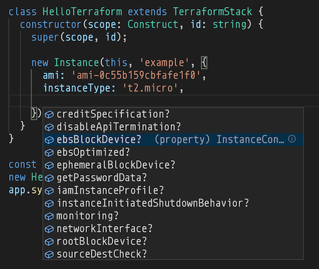

# Terraform CDK

Terraform CDK (Cloud Development Kit) allows developers to use familiar
programming languages to define cloud infrastructure and provision it through
Terraform.

This is a prototype.


## Getting Started

Until this project is released to npm, we will need to clone, build and link this repository so it can be used locally:

```shell
$ git clone https://github.com/eladb/tfcdk
$ cd tfcdk
$ yarn install
$ yarn build
$ yarn link
```

### Prerequisites

Please make sure to install the following prerequisites on your machine:

- [Terraform >= v0.12](https://www.terraform.io/)
- [Node.js >= v12](https://nodejs.org)
- [Yarn >= 1.21](https://yarnpkg.com/en/docs/install)

### Create a new Project

Let's create a new TypeScript project:

```shell
$ mkdir hello-tfcdk
$ cd hello-tfcdk
$ yarn init -y
$ yarn add -D typescript @types/node
$ curl -L http://bit.ly/366kmyl > tsconfig.json
```

tfcdk uses the **constructs programming model** which is currently part of the AWS CDK's core library. We plan to extract it into an independent module.

```shell
$ yarn add @aws-cdk/core
```

Link your local copy of tfcdk:

```shell
$ yarn link tfcdk
```

### Generate resource classes

Similarly to the AWS CDK, resources in Terraform CDK are modeled as constructs. Contrary to the AWS CDK, which is shipped with "CFN resources" that correspond to all AWS CloudFormation resources, Terraform does not have a single resource specification.

Therefore, resource classes in Terraform CDK are not shipped with the framework, but rather generated by users on-demand.

The framework includes a tool called `tfgen` which can be used to generate resource classes for any Terraform provider.

Let's generate resource classes for the `aws` provider:

```shell
$ npx tfgen aws
```

> You can pass any number of terraform provider names (e.g. `tfgen aws google`).

Once this is done, you should have a directory `.gen/aws` with typescript files that implement all resources for the `aws` provider. For example, you will be able to find `.gen/aws/instance.ts` which includes the `Instance` or the `.gen/aws/dynamodb-table.ts` which includes the `DynamodbTable` resource.

### Create a Terraform CDK app

Okay, we are ready to define our first Terraform CDK app.

Let's create a file `index.ts`:

```ts
import { App, Construct } from '@aws-cdk/core';
import { TerraformStack } from 'tfcdk';
import { Instance } from './.gen/aws/instance';

class HelloTerraform extends TerraformStack {
  constructor(scope: Construct, id: string) {
    super(scope, id);

    new Instance(this, 'example', {
      ami: 'ami-0c55b159cbfafe1f0',
      instanceType: 't2.micro',
    });
  }
}

const app = new App({ outdir: 'cdk.out' });
new HelloTerraform(app, 'hello-tfcdk');
app.synth();
```

If you use an IDE, you will see that our generated `Instance` class has full type information, so your IDE will help you with code-completion and validation:



### Synthesize

The next step is to synthesize a terraform configuration JSON from our CDK app. 

First, we need to build our app using the TypeScript compiler:

```shell
$ npx tsc
```

Now, we can run it:

```shell
$ node index.js
```

You will notice that a new directory `cdk.out` has been created and includes a `hellotfcdk.tf.json` file:

```shell
$ cat cdk.out/hellotfcdk.tf.json
{
  "resource": {
    "aws_instance": {
      "hellotfcdkexample961AD2B4": {
        "ami": "ami-0c55b159cbfafe1f0",
        "instance_type": "t2.micro"
      }
    }
  }
}
```

This is a ready-to-apply terraform JSON.

### Apply

Next, let's provision our infrastructure through terraform (use `us-east-2` since this is where this AMI is from):

```shell
$ (cd cdk.out && terraform apply)
provider.aws.region
  The region where AWS operations will take place. Examples
  are us-east-1, us-west-2, etc.

  Enter a value: us-east-2


An execution plan has been generated and is shown below.
Resource actions are indicated with the following symbols:
  + create

Terraform will perform the following actions:

  # aws_instance.hellotfcdkexample961AD2B4 will be created
  + resource "aws_instance" "hellotfcdkexample961AD2B4" {
      + ami                          = "ami-0c55b159cbfafe1f0"
      + arn                          = (known after apply)
      + associate_public_ip_address  = (known after apply)
      + availability_zone            = (known after apply)
      + cpu_core_count               = (known after apply)
      + cpu_threads_per_core         = (known after apply)
...


aws_instance.hellotfcdkexample961AD2B4: Creating...
aws_instance.hellotfcdkexample961AD2B4: Still creating... [10s elapsed]
aws_instance.hellotfcdkexample961AD2B4: Still creating... [20s elapsed]
aws_instance.hellotfcdkexample961AD2B4: Creation complete after 30s [id=i-03315242e2a5291fc]

Apply complete! Resources: 1 added, 0 changed, 0 destroyed.
```

### References

## Roadmap

- [ ] Provider definitions
- [ ] Data sources
- [ ] Getters for block types, arrays, maps, etc
- [ ] Modules
- [ ] A million other things

## License

Licensed under [Apache 2.0](./LICENSE)

