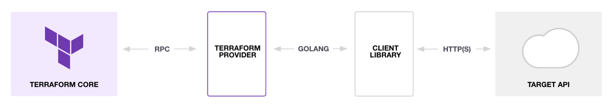

# Providers

A [provider](/language/providers) is a Terraform plugin that allows users to manage an external API. Provider plugins like the [AWS provider](https://registry.terraform.io/providers/hashicorp/aws/latest) or the [cloud-init provider](https://registry.terraform.io/providers/hashicorp/cloudinit/latest/docs) act as a translation layer that allows Terraform to communicate with many different cloud providers, databases, and services.



Terraform uses providers to provision [resources](/language/resources), which describe one or more infrastructure objects like virtual networks and compute instances. Each provider on the [Terraform Registry](https://registry.terraform.io/) has documentation detailing available resources and their configuration options.

In your CDK for Terraform (CDKTF) application, you will use your preferred programming language to define the resources you want Terraform to manage on one or more providers. This page explains how to install and use providers in your CDKTF application. Refer to [Resources](/cdktf/concepts/resources) for details about defining infrastructure resources and changing resource behavior.

You can install pre-built providers, import providers from the Terraform Registry, or reference local providers to define resources for your application. CDKTF generates the required code bindings from the providers you define in [`cdktf.json`](/cdktf/create-and-deploy/configuration-file). This allows you to define resources for that provider in your preferred programming language.

You can also use the [`provider add` command](/cdktf/cli-reference/commands#provider-add) to add providers to your CDKTF application. It will automatically try to install a pre-built provider if available and fall back to generating bindings locally if none was found.

### Import Providers

CDK for Terraform lets you import Terraform [providers](/language/providers) to your project.

This TypeScript example project has a `main.ts` file that defines AWS resources.

```typescript
import { Construct } from "constructs";
import { App, TerraformStack } from "cdktf";
import { AwsProvider } from "./.gen/providers/aws/provider";
import { Instance } from "./.gen/providers/aws/instance";

class MyStack extends TerraformStack {
  constructor(scope: Construct, id: string) {
    super(scope, id);

    new AwsProvider(this, "aws", {
      region: "us-east-1",
    });

    new Instance(this, "Hello", {
      ami: "ami-2757f631",
      instanceType: "t2.micro",
    });
  }
}

const app = new App();
new MyStack(app, "hello-terraform");
app.synth();
```

#### Add Provider to `cdktf.json`

To use a new provider, first add it to the `"terraformProviders"` array in the [`cdktf.json` file](/cdktf/create-and-deploy/configuration-file).

The following example adds the [DNS Simple](https://registry.terraform.io/providers/dnsimple/dnsimple/latest/docs) provider.

```json
{
  "language": "typescript",
  "app": "npm run --silent compile && node main.js",
  "terraformProviders": ["aws@~> 2.0", "dnsimple/dnsimple"]
}
```

#### Generate Classes

Go to the working directory and run `cdktf get` to create the appropriate TypeScript classes for the provider automatically.

```bash
cdktf get
⠋ downloading and generating providers...
```

```bash
Generated typescript constructs in the output directory: .gen
```

#### Import Classes

Import and use the generated classes in your application. The following TypeScript example imports the `DnsimpleProvider` and `Record` resources from `./.gen/providers/dnsimple` and defines them.

```typescript
import { Construct } from "constructs";
import { App, TerraformStack, Token } from "cdktf";
import { AwsProvider } from "./.gen/providers/aws/provider";
import { Instance } from "./.gen/providers/aws/instance";
import { DnsimpleProvider } from "./.gen/providers/dnsimple/provider";
import { Record } from "./.gen/providers/dnsimple/record";

class MyStack extends TerraformStack {
  constructor(scope: Construct, id: string) {
    super(scope, id);

    new AwsProvider(this, "aws", {
      region: "us-east-1",
    });

    const instance = new Instance(this, "Hello", {
      ami: "ami-2757f631",
      instanceType: "t2.micro",
    });

    new DnsimpleProvider(this, "dnsimple", {
      token: Token.asString(process.env.DNSIMPLE_TOKEN),
      account: Token.asString(process.env.DNSIMPLE_ACCOUNT),
    });

    new Record(this, "web-www", {
      domain: "example.com",
      name: "web",
      value: instance.publicIp,
      type: "A",
    });
  }
}

const app = new App();
new MyStack(app, "hello-terraform");
app.synth();
```

Use the `synth` command to convert your code into a JSON Terraform configuration file.

```bash
cdktf synth --json
```

```json
{
  "//": {
    "metadata": {
      "version": "0.0.11-pre.8757404fa25b6e405f1a51eac11b96943ccb372e",
      "stackName": "vpc-example"
    }
  },
  "terraform": {
    "required_providers": {
      "aws": "~> 2.0",
      "dnsimple": "undefined"
    }
  },
  "provider": {
    "aws": [
      {
        "region": "us-east-1"
      }
    ],
    "dnsimple": [
      {
        "account": "hello@example.com",
        "token": "xxxxxxxxxx"
      }
    ]
  },
  "resource": {
    "aws_instance": {
      "vpcexample_Hello_279554CB": {
        "ami": "ami-2757f631",
        "instance_type": "t2.micro",
        "//": {
          "metadata": {
            "path": "vpc-example/Hello",
            "uniqueId": "vpcexample_Hello_279554CB",
            "stackTrace": [
              .....
            ]
          }
        }
      }
    },
    "dnsimple_record": {
      "vpcexample_webwww_477C7150": {
        "domain": "example.com",
        "name": "web",
        "type": "A",
        "value": "${aws_instance.vpcexample_Hello_279554CB.public_ip}",
        "//": {
          "metadata": {
            "path": "vpc-example/web-www",
            "uniqueId": "vpcexample_webwww_477C7150",
            "stackTrace": [
              .....
            ]
          }
        }
      }
    }
  }
}

```

### Install Pre-built Providers

It can take several minutes to generate the code bindings for providers with very large schemas, so we offer several popular providers as pre-built packages. Pre-built providers are a completely optional performance optimization, and you may prefer to generate the code bindings for these providers yourself. For example, you may want to use a different version of that provider than the one in the pre-built package. The [Terraform CDK Providers](https://github.com/orgs/hashicorp/repositories?q=cdktf-provider-) page has a complete list, but available pre-built providers include:

- [AWS Provider](https://cdk.tf/provider/aws)
- [Google Provider](https://cdk.tf/provider/google)
- [Azure Provider](https://cdk.tf/provider/azurerm)
- [Kubernetes Provider](https://cdk.tf/provider/kubernetes)
- [Docker Provider](https://cdk.tf/provider/docker)
- [Github Provider](https://cdk.tf/provider/github)
- [Null Provider](https://cdk.tf/provider/null)

These packages are regularly published to NPM / PyPi, and you can treat them as you would any other dependency. The following example shows how to install the AWS provider in TypeScript / Node.

```
npm install @cdktf/provider-aws
```

When you choose to install a pre-built provider via `npm install`, you should not define that provider again in your `cdktf.json` file. If you receive errors while running `cdktf synth` because of duplicate providers, remove the duplicates from your `cdktf.json` file, delete `tsbuildinfo.json`, and try running `cdktf synth` again.

### Provider Caching

Caching prevents CDK for Terraform from re-downloading providers between each CLI command. It is also useful when you need to remove the `cdktf.out` folder and re-synthesize your configuration. Finally, caching is necessary when you use multiple [stacks](/cdktf/concepts/stacks) within one application.

#### Set the Caching Directory

Refer to the Terraform documentation about [how to configure your plugin cache](/cli/config/config-file#provider-plugin-cache). Otherwise, CDKTF automatically sets the `TF_PLUGIN_CACHE_DIR` environment variable to `$HOME/.terraform.d/plugin-cache` when you use `cdktf` cli commands.

To disable this behavior, set `CDKTF_DISABLE_PLUGIN_CACHE_ENV` to a non null value, like `CDKTF_DISABLE_PLUGIN_CACHE_ENV=1`. You may want to do this when a different cache directory is configured via a `.terraformrc` configuration file.

### Use a Local Provider

Terraform needs to know the location of local providers to enable CDKTF to generate the appropriate type bindings. You can configure this in two ways:

- [Implied Local Mirrors](/cli/config/config-file#implied-local-mirror-directories)
- [Development Overrides](/cli/config/config-file#development-overrides-for-provider-developers)

Once configured properly, you can reference these providers in the `cdktf.json` file the same way that you reference providers from the Terraform Registry. Refer to the [project configuration documentation](/cdktf/create-and-deploy/configuration-file) for more details about the `cdktf.json` specification.
