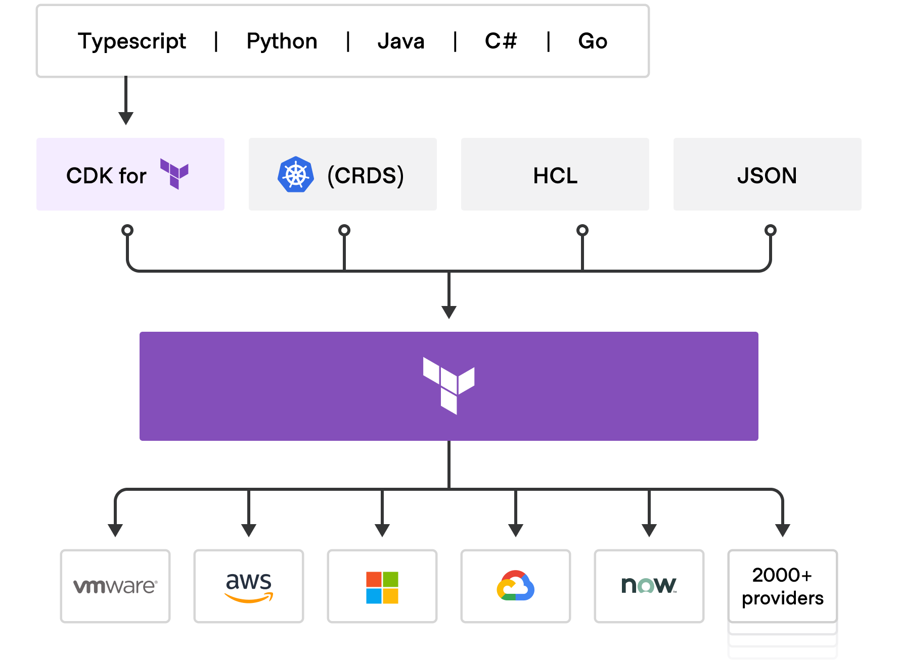

# CDK for Terraform

Cloud Development Kit for Terraform (CDKTF) allows you to use familiar programming languages to define and provision infrastructure. This gives you access to the entire Terraform ecosystem without learning HashiCorp Configuration Language (HCL) and lets you leverage the power of your existing toolchain for testing, dependency management, etc.

We support TypeScript, Python, Java, C#, and Go.

## How does CDK for Terraform work?

CDK for Terraform leverages concepts and libraries from the [AWS Cloud Development Kit](https://aws.amazon.com/cdk/) to translate your code into infrastructure configuration files for Terraform.

At a high level, you will:

1. **Create an Application:** Use either a built-in or a custom template to scaffold a project in your chosen language.
1. **Define Infrastructure:** Use your chosen language to define the infrastructure you want to provision on one or more providers. CDKTF automatically extracts the schema from Terraform providers and modules to generate the necessary classes for your application.
1. **Deploy**: Use `cdktf` CLI commands to provision infrastructure with Terraform or synthesize your code into a JSON configuration file that others can use with Terraform directly.

You can use every Terraform provider and module available on the [Terraform Registry](https://registry.terraform.io/), and you can use CDKTF with [Terraform Cloud](https://cloud.hashicorp.com/products/terraform), [Terraform Enterprise](/enterprise), and HashiCorp's policy as code framework, [Sentinel](https://www.hashicorp.com/sentinel).

## When to use CDK for Terraform

CDKTF offers many benefits, but it is not the right choice for every project. You should consider using CDKTF when:

- You have a strong preference or need to use a procedural language to define infrastructure.
- You need to create abstractions to help manage complexity. For example, you want to create constructs to model a reusable infrastructure pattern composed of multiple resources and convenience methods.
- You are comfortable doing your own troubleshooting and do not require commercial support.

You can make this choice for each team and project because CDK for Terraform [interoperates with existing Terraform providers and modules](/cdktf/concepts/hcl-interoperability).

## Choosing a Language for your Project

Consider which of the supported languages you are most familiar with and which language best fits your organization's current tooling. We work towards providing feature parity and a good user experience across all supported languages, but there may be instances when new experimental features will not be available for all languages.

If you plan to create and package your own constructs, we recommend choosing TypeScript. Using TypeScript allows you to use the [cdktf constructs](https://github.com/projen/projen#getting-started) package generator to build and publish your constructs in multiple languages.

## Get Started

- [Install CDKTF](https://learn.hashicorp.com/tutorials/terraform/cdktf-install?in=terraform/cdktf) and set up your first project.
- Learn about [CDKTF application architecture](/cdktf/concepts/cdktf-architecture).
- Learn how to use key CDKTF concepts like [providers](/cdktf/concepts/providers), [modules](/cdktf/concepts/modules), and [resources](/cdktf/concepts/resources) to define infrastructure.
